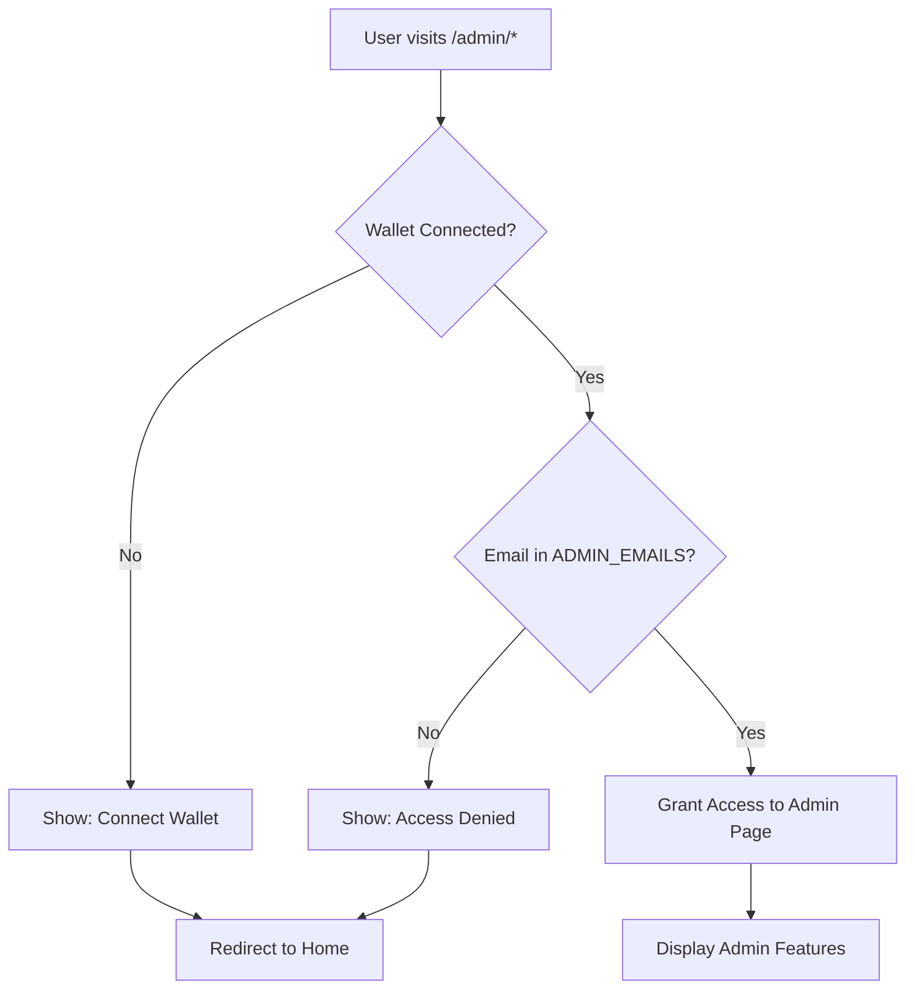

# 🔒 Admin Access Security Configuration

## 🎯 Overview

Trang admin của ViePropChain được bảo vệ bởi **2 lớp security**:

1. ✅ **Wallet Connection** - Phải kết nối MetaMask
2. ✅ **Email Whitelist** - Chỉ cho phép email admin được chỉ định

---

## 👤 Admin Account

### **Current Admin Email:**

```
todat2207@gmail.com
```

**⚠️ CHÚ Ý:** Chỉ tài khoản này mới có quyền truy cập tất cả trang admin!

---

## 🛡️ Security Implementation

### **1. AdminContext.js** - Email Whitelist

```javascript
// src/contexts/AdminContext.js
const ADMIN_EMAILS = React.useMemo(
  () => [
    "todat2207@gmail.com", // Super Admin - Full Access
  ],
  []
);
```

**Logic:**

- Check user email từ Google OAuth
- So sánh với ADMIN_EMAILS list
- Set `isAdmin = true` nếu match

---

### **2. ProtectedRoute.js** - Route Guard

```javascript
// src/components/ProtectedRoute/ProtectedRoute.js
const ProtectedRoute = ({ children }) => {
  const { isAdmin, isCheckingAdmin } = useAdmin();
  const { account } = useWeb3();

  // 1. Check wallet connected
  if (!account) {
    return <WalletRequiredError />;
  }

  // 2. Check admin permission
  if (!isAdmin) {
    return <AccessDeniedError />;
  }

  // 3. Allow access
  return children;
};
```

---

### **3. App.js** - Protected Routes

Tất cả admin routes đều được bảo vệ:

```javascript
// 🔒 Protected Admin Routes
<Route path="/admin" element={<ProtectedRoute><Dashboard /></ProtectedRoute>} />
<Route path="/admin/dashboard" element={<ProtectedRoute><Dashboard /></ProtectedRoute>} />
<Route path="/admin/nft" element={<ProtectedRoute><Nft /></ProtectedRoute>} />
<Route path="/admin/list-nft" element={<ProtectedRoute><ListNFT /></ProtectedRoute>} />
<Route path="/admin/users" element={<ProtectedRoute><Users /></ProtectedRoute>} />
<Route path="/admin/properties" element={<ProtectedRoute><Properties /></ProtectedRoute>} />
```

---

## 🚫 Access Scenarios

### **Scenario 1: Không kết nối wallet**

```
Status: ❌ BLOCKED
Message: "Please connect your wallet to access this page."
Action: Redirect về trang chủ
```

---

### **Scenario 2: Kết nối wallet nhưng không phải admin email**

```
Status: ❌ ACCESS DENIED
Message: "Chỉ tài khoản admin todat2207@gmail.com mới có quyền truy cập."
Current Account: 0x742d35Cc6634C0532925a3b844Bc9e7595f0bEb2
Action: Hiển thị error page + button quay về trang chủ
```

---

### **Scenario 3: Admin email (todat2207@gmail.com) + Wallet connected**

```
Status: ✅ ACCESS GRANTED
Action: Hiển thị admin page đầy đủ
```

---

## 🔄 Authentication Flow



---

## 📋 Admin Pages

### **Protected Pages:**

1. **Dashboard** - `/admin` or `/admin/dashboard`

   - Tổng quan hệ thống
   - Thống kê NFTs, Users, Properties
   - System health monitoring

2. **Mint NFT** - `/admin/nft`

   - Tạo NFT mới cho BĐS
   - Upload metadata lên IPFS
   - Mint on-chain

3. **Quản lý NFT** - `/admin/list-nft`

   - Danh sách tất cả NFTs
   - Transfer, Burn functions
   - View metadata

4. **Quản lý Users** - `/admin/users`

   - Danh sách người dùng
   - Wallet linking status
   - User verification

5. **Quản lý Properties** - `/admin/properties`
   - Database BĐS
   - Property status
   - Mint/Update operations

---

## 🔧 How to Add More Admins

### **Step 1: Update AdminContext.js**

```javascript
// src/contexts/AdminContext.js
const ADMIN_EMAILS = React.useMemo(
  () => [
    "todat2207@gmail.com", // Super Admin
    "another@gmail.com", // New Admin
  ],
  []
);
```

### **Step 2: Restart React App**

```bash
npm start
```

### **Step 3: Verify Access**

1. Login với new admin email
2. Kết nối wallet
3. Navigate to `/admin`
4. Confirm access granted

---

## 🧪 Testing

### **Test Case 1: Non-admin User**

```bash
# 1. Login với email khác (không phải todat2207@gmail.com)
# 2. Connect wallet
# 3. Navigate to http://localhost:3000/admin
# Expected: Access Denied screen
```

---

### **Test Case 2: Admin User**

```bash
# 1. Login với todat2207@gmail.com
# 2. Connect wallet
# 3. Navigate to http://localhost:3000/admin
# Expected: Dashboard hiển thị đầy đủ
```

---

### **Test Case 3: No Wallet**

```bash
# 1. Login với todat2207@gmail.com
# 2. DON'T connect wallet
# 3. Navigate to http://localhost:3000/admin
# Expected: "Please connect your wallet" message
```

---

## 🔍 Debug Mode

### **Check Admin Status:**

Mở browser console và kiểm tra:

```javascript
// Check if admin context is working
console.log("User:", user);
console.log("Is Admin:", isAdmin);
console.log("Admin Emails:", ADMIN_EMAILS);
```

Expected output for admin:

```javascript
{
  email: "todat2207@gmail.com",
  role: "admin",  // if set in backend
  isAdmin: true
}
```

---

## ⚠️ Security Best Practices

### **1. Environment Variables (Production)**

Thay vì hardcode email, dùng `.env`:

```env
# .env
REACT_APP_ADMIN_EMAILS=todat2207@gmail.com,another@gmail.com
```

```javascript
// AdminContext.js
const ADMIN_EMAILS = React.useMemo(
  () => process.env.REACT_APP_ADMIN_EMAILS?.split(",") || [],
  []
);
```

---

### **2. Backend Validation**

Frontend check chỉ là UI/UX. Backend API cũng phải check:

```javascript
// API Gateway middleware
const checkAdmin = async (req, res, next) => {
  const userEmail = req.user?.email;

  if (userEmail !== "todat2207@gmail.com") {
    return res.status(403).json({
      success: false,
      error: "Admin access required",
    });
  }

  next();
};

// Apply to admin routes
app.use("/api/admin/*", verifyToken, checkAdmin);
```

---

### **3. Audit Logging**

Log tất cả admin actions:

```javascript
// Log mỗi khi admin thực hiện action
console.log(`[ADMIN] ${user.email} - ${action} - ${timestamp}`);
```

---

## 📊 Current Status

✅ **Implemented:**

- Email whitelist: `todat2207@gmail.com`
- Wallet connection requirement
- Protected routes for all admin pages
- Access denied error messages
- Admin context & hooks

⚠️ **Recommended (Future):**

- Move admin emails to .env
- Add backend admin validation
- Implement audit logging
- Add role-based permissions (super admin, moderator, etc.)
- 2FA for admin accounts

---

## 🎯 Summary

**Current Security:**

- ✅ Chỉ `todat2207@gmail.com` có quyền admin
- ✅ Phải kết nối wallet để truy cập
- ✅ Tất cả admin routes đều được protect
- ✅ Clear error messages cho unauthorized users

**Access URL:**

```
http://localhost:3000/admin
http://localhost:3000/admin/dashboard
http://localhost:3000/admin/nft
http://localhost:3000/admin/list-nft
http://localhost:3000/admin/users
http://localhost:3000/admin/properties
```

**Admin Account:**

```
Email: todat2207@gmail.com
Role: Super Admin
Permissions: Full Access
```
